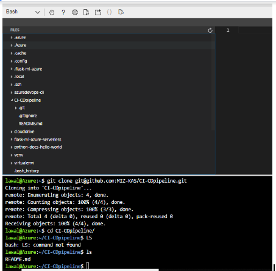
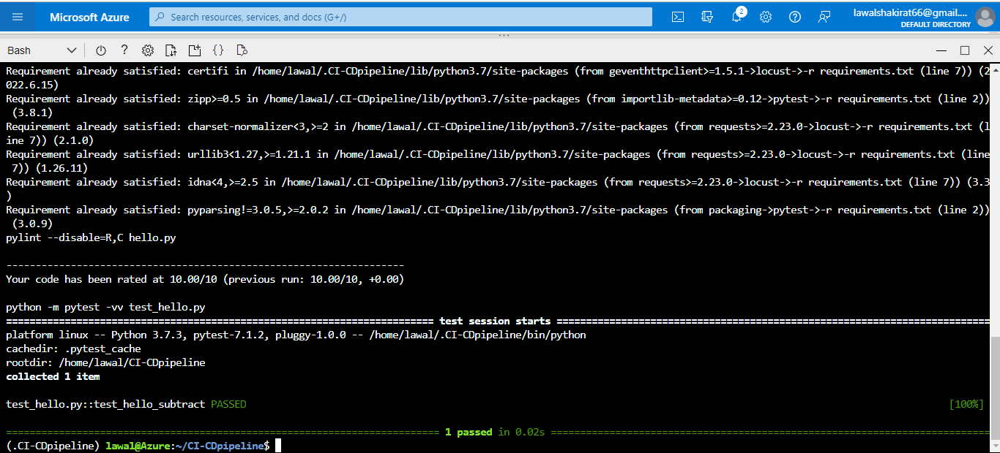
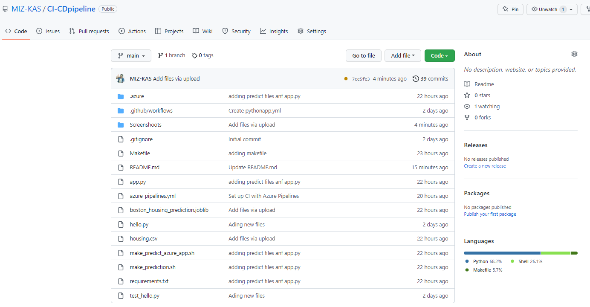

[](https://github.com/MIZ-KAS/CI-CDpipeline/actions/workflows/pythonapp.yml)

# Building CI-CDpipeline


## Overview

This project demonstrate how to build Github repository from scratch and creatong a scaffolding that will assist in performing both COntinuous integration and Continuous Delivery. Some of the other actions incloud 

  * Creating Github Actions along with a Makefile, requirement.txt file
  * Application code to perform an initial lint, test and install cycle.
  * and lastly Inegrating the project with Azure Pipelines to enable Continuous Delivery to Azure App Service.

A short demo of the project is included here. 

## Architectural Diagram

Fine below flow of the project 


## Status

[](https://github.com/MIZ-KAS/CI-CDpipeline/actions/workflows/pythonapp.yml)

## Project Plan 

### Spreedsheet

In this [spreedsheet](https://docs.google.com/spreadsheets/d/1G2UlwSD3HVO32IbAr77t-I1oMyIP3ido7AKpit3aojg/edit?usp=sharing), I have included a quarterly and yearly plan. also included is a estimated week by week deliverables with an estimated time of difficulity for each task.


### Trello Board 

In the [trello board](https://trello.com/invite/b/pXPo2Yyz/afce1f39f9ca2cc8c565ca5800a6fad4/project-2-building-a-ci-cd-pipeline) i have included a simple board based flow as below
 * To Do,
 * In Progress and 
 * Done

## CI: Set Up Azure Cloud Shell

 ## Create the Cloud-Based Development Environment
 
 I created a [GitHub](https://github.com/MIZ-KAS/CI-CDpipeline) Repo then created a ssh-keys in my Azure Cloud Shell environment after which i clone the newly created repo into Azure Cloud Shell, screenshoot below
 



  ## Creating the Makefile 
  
  ```bashinstall:
	pip install --upgrade pip &&\
		pip install -r requirements.txt
	
test:
	python -m pytest -vv test_hello.py

lint:
		pylint --disable=R,C hello.py

all: install lint test
```
 
 ## Creating the requirements.txt
 
   ```bashinstall:
pylint
pytest
Flask==2.0.3
pandas==0.24.2
scikit-learn==0.20.3
jinja2==3.0
```

 ## Creating the Python Virtual Environment and source into it
 
   ```bashinstall:
python3 -m venv ~/.CI-CDpipeline
source ~/.CI-CDpipeline/bin/activate
```

## Local test 

```bash
(.CI-CDpipeline) lawal@Azure:~/CI-CDpipeline$ make all
```



Testing it locally to check the prediction by running python app.py and running ./make_prediction.sh to see the prediction locally 


## CI: Configure GitHub Actions

This is to create a gitHub Actions to test the project upon change events in GitHub. This is a necessary step to performing Continuous Integration remotely.

Enable Github Actions and replace yml code with below:

```bash
name: Python application test with Github Actions

on: [push]

jobs:
  build:

    runs-on: ubuntu-latest

    steps:
    - uses: actions/checkout@v2
    - name: Set up Python 3.5
      uses: actions/setup-python@v1
      with:
        python-version: 3.5
    - name: Install dependencies
      run: |
        make install
    - name: Lint with pylint
      run: |
        make lint
    - name: Test with pytest
      run: |
        make test
```

Lasly i put the changes to GitHub and verify both ``lint`` and ``test``

See screenshoot below 


## Continuous Delivery on Azure

Final step in the project is to set Continuous Delivery using Azure technologies. This will involve setting up Azure Pipelines to deploy the [Flask starter](https://github.com/udacity/nd082-Azure-Cloud-DevOps-Starter-Code/tree/master/C2-AgileDevelopmentwithAzure/project/starter_files) code to Azure App Services.



## Deploying to Azure App Services

Deploy the web app to azure using az webapp up -n <your-appservice>


```bash
(.CI-CDpipeline) lawal@Azure:~/CI-CDpipeline$ az webapp up -n azurecicdpipeline
```
	
	
	
Check if the app is up and running by opening the URL containing the webapp name provided in the previous step: https://azurecicdpipleline.azurewebsites.net/
	
	
	
	
Edit file 'make_predict_azure_app.sh' and replace '< yourappname >' with your webapp name (e.g. azurecicdpipeline).

Test the remote webapp:


	

#### Logs of your running webapp via Azure Cloud shell
	
```bash
(.CI-CDpipeline) lawal@Azure:~/CI-CDpipeline$ az webapp log tail
```	
	
	
#### Performance validation of the webapp can be performed via a load test using [locust](https://locust.io/). Replace '< yourappname >' in the provided configuration and call locust:
	
Using the parameters above locust will use 20 users with a spawn rate of 5 users per second and run for 20 seconds:
	
```bash
(.CI-CDpipeline) lawal@Azure:~/CI-CDpipeline$ locust -f locustfile.py --headless -u 20 -r 5 -t 20s
```	
	
	
	
	
## Setting up CI/CD using Azure Pipelines
* Goto Azure DevOps Organizations, create a new project called CICDAzuredev
* Ensure you set up a new service connection via Azure Resource Manager and Pipeline
* Goto organizations setting > new service connection (under pipeline) > Azure Resource Manager 
* Next, select Pipeline and create a new one
* Create the GitHub Integration
* Configure python to Linux Web app on Azure
* Set up the continuous delivery workflow

	
	
	
	
	
	
	
	
From now on every change to your code will trigger the CI/CD pipeline and update your webapp accordingly:

See below example of resent work after deployment 

	
	

	
## Final step 
	
From Azure CLI do Git pull and Push so that every thing will be upto date


	
## Enhancements
	
To make the application globally so user can run a predict at one click.
	
## Demo Video
